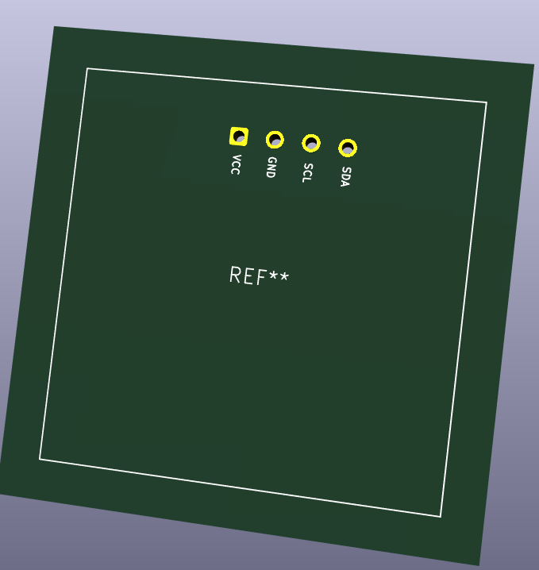

# JOURNAL DU 09 SEPTEMBRE 2026: Rédigé par LANDAM Pyabalo
## Fait aujourd'hui 
### On a continuer avec la conception des PCB
- Objectif: Realiser un projet tout entier (A partir d'un schema electrique, passant par le PCB, le code python jusqu'a la programmation): 
Titre: Allumage_Led

- On a ainsi commencer par le schema electronique comportant: une Led, un condensateur, un XIAO ESP32, 2 resistances, l'ecran Oled et un bouton poussoir.

- L'ecran oled n'est pas dnas la bibliotheque de simboles, donc on l'a concu dans parametre editeur de symoles avec ses 4 pines (VCC; GND; SCL et SDA)

- Apres on a assigné les empreintes et ensuite passer dans l'editeur de PCB pour tracer les pistes cuivrées.
- En fin, on a commencer l'ecrire du code python pour notre systeme 
## Appeis
J'ai appris la conception de de l'ecran Oled, l'importer et le cabler avec les autres  composants existants
## Raté
J'ai du mal a tracer les pistes sur la plaque PCB.
## A faire demain
On va essayer de tracer les pistes cuivrees.