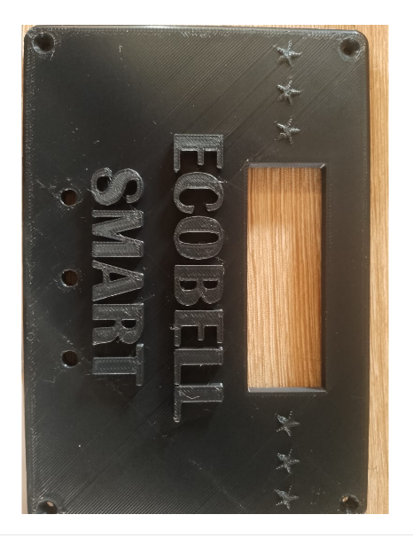
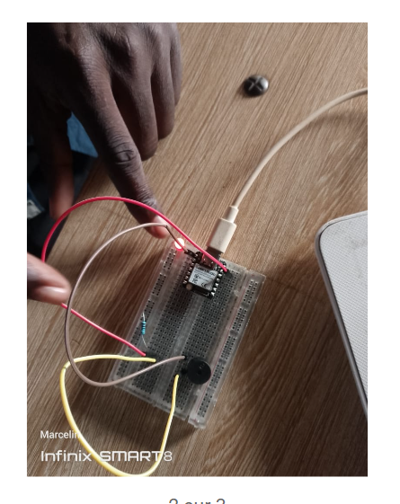

# JOURNAL DU 11 SEPTEMBRE 2026: Rédigé par LANDAM Pyabalo
## Fait aujourd'hui
- Impression du couvercle de notre boitier du systeme de commande

  
------------------------------
- Acquisition d'autres composants (3 Resistances, 2 modules de charge, une RTC, 12 fils de connexion et une led)
------------------
- Initiation au code C++ sur Arduino IDE, permettant de faire clignotter une led

   
----------
 ## Appris
 J'ai appris a commender un circuit grace au code C++ dans Arduinio IDE
 ## Raté
 Il nous manque la pile de RTC, les condensateurs, les diodes et la sirene raison pour laquelle nous n'avaons pas realisé notre circuit
 ## A faire demain
 Demain on va essayer de faire le circuit electrique si on a pu avoir le reste de nos composants
  