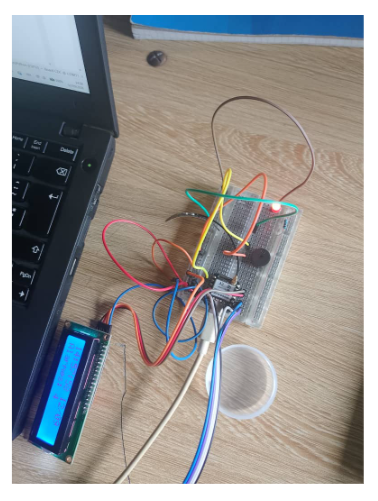
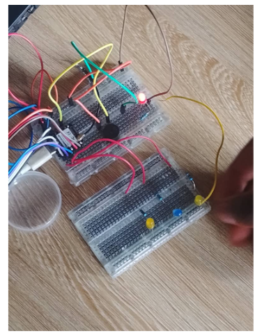
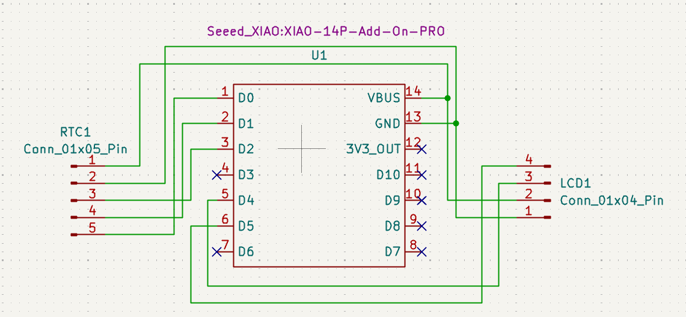
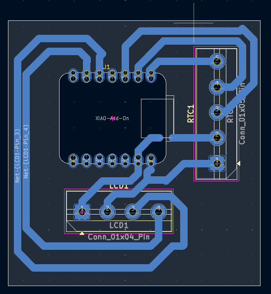
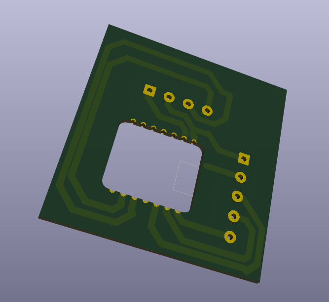

# JOURNAL DU 12 SEPTEMBRE 2026: Rédigé par LANDAM Pyabalo
## Fait aujourd'hui
- On a commencer le cablage de notre premier circuit (Le systeme de commande):
Les differentes connexions entre le module RTC et l'ecran LCD et le XIAO-ESP32-S3

|    Module RTC      | XIAO-ESP32-S3 |
|---|---|
| Vcc                 |          5V  
| GND    |       GND
| SCLK  |    D2|
| DAT| D1|
|RST| D0|

---

|Ecran LCD|    XIAO-ESP32-S3|
|---|---|
|GND|GND|
VCC|5V|
SDA| D4 | 
SCL | D5
---

- Apres on a televerser notre code C++ au XIAO et ca a marche: le XIAO lit parffaitement l'heure sur le module RTC et l'affiche sur l'ecran LCD
- Ensuite  on a ajouter le buzzer qu'on a branche sur la broche D7, et il fonctionne.
- Ensuite on a ajouter la Led de temoin en serie avec une resistance pour ne pas qu'elle grille: elle est parfaitrmrnt alumee. 

  .
- En fin on a ajouter les trois leds qui doivent clignotter lorsque lq sirene est en action, et elle sont aussi alumees.

  

- Nous avons aussi realiser le circuit electrique se notre systeme de commande et commencer par faire son PCB sur KiCad

  

  

  

## Appris
- J'ai appris a cabler le XIAO, le module RTC et l'ecran LCD sur la plaquette SK10
- J'ai aussi les branchements de des Leds sur le circuit
- J'ai aussi appris a tracer les pistes cuivrees des PCB sur KiCad

## A faire Lundi
Le lundi nous allons finaliser avec le PCB de notre systeme de commande et commencer le cablage de notre systeme de reception (la sirene).