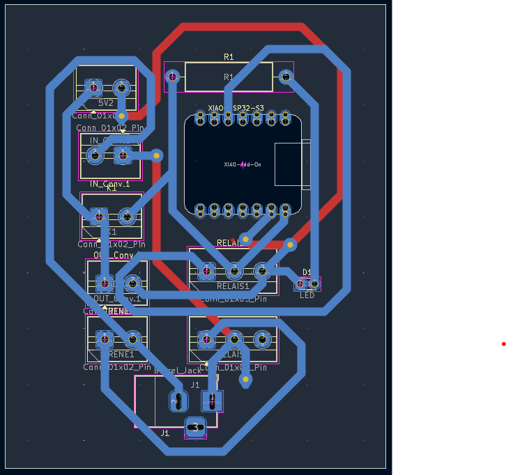

# JOURNAL DU 14 SEPTEMBRE 2026: Rédigé par LANDAM Pyabalo
## Fait aujourd'hui
- On a pris notre dernier composant (la sirene), puis commencé le vrai essa
   

- On a repris le cablage du vendredi (entre XIAO, RTC et ecran LCD) puis on a cabler le circuit du deuxieme boitier (entre XIAO, le module de relais et la sirene) 
- Le circuit a parfaitement fonctionné 

   

   ### LE FONCTIONEMENT 
Nous avons franchi une etape tres importante de notre projet, le test de tout notre projet en entier marche: Systeme de Sonnerie Automatique Sans Fils. 
Deux XIAO-ESP32-S3 differents se communiquent grace a leur WIFI interne. Le premier ESP, grace au module RTC qui lui donne l'heure exacte, envoie le signale au second: "il est l'heure tu peux sonner", et il declenche la sirene. On a televersé deux codes C++ differents dans les deux ESP en deffinissant toutes les broches utilisées pour le cablage. Pour toute modification, n a créé un site Web sur lequel on modofie tout. 
   

   

- Apres avoir reussi le test nous avons continuer et finir avec le PCB du premier boitier 
- On a ainsi fait l'impression du PCB du systeme de commande

   

- On a enchainé avec le circuit du second boitier (pour la sirene).

    
 
## Appris
- J'ai appris aujourd'hui a cabler notre circuit de la sonnerie sur la SK10
- J'ai maitrisé le fonctionntment de notre projet tout entier que je pourai moi meme cabler tout seul
- J'ai enfin maitrisé parfaitement la tracée des pistes de cuivre sur les PCB 

## Raté
Le PCB qu'on a imprimé etait mal fait, on a du l'abandonné et reprendre un autre.

## A faire demain
Demain nous allons terminer le deuxieme PCB et l'imprimer et aussi peut etre imprimer aussi nos boitiers.