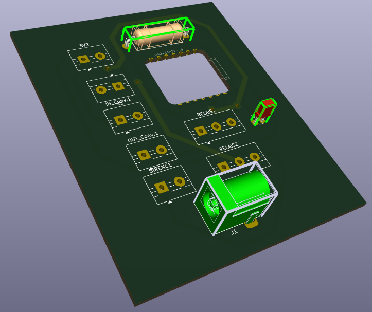

# JOURNAL DU 15 SEMPEMBRE 2026: Rédigé par LANDAM Pyabalo
## Fait auhourd'hui
- On a soudé les composants sur notre PCB du systeme de commande 

    

- En suite on a terminé le circuit electrique du systeme de reception, tracé les pistes cuivrées.

    
    

- Apres on a imprimé le PCB du systeme de reception 

   

- On a enfin avant de partir, lancer les impressions des couvercles de nos 2 boitiers
## Appris 
 J'ai appris a souder les composnts sur un PCB             
## Raté
Lorsqu'on soudait les composants, nous avons inversé les pines male-male, domc on a désoudé les parties erronnées, changé de pines et refaire la soudure.

   

## A faire demain
On a prévu finir tout notre projet demain (soudé les composants sur le second PCB, imprimé tous nos boitier et faire le montage final dans les boitier) afin de se concentré sur le power point et la documentation les jours apres.